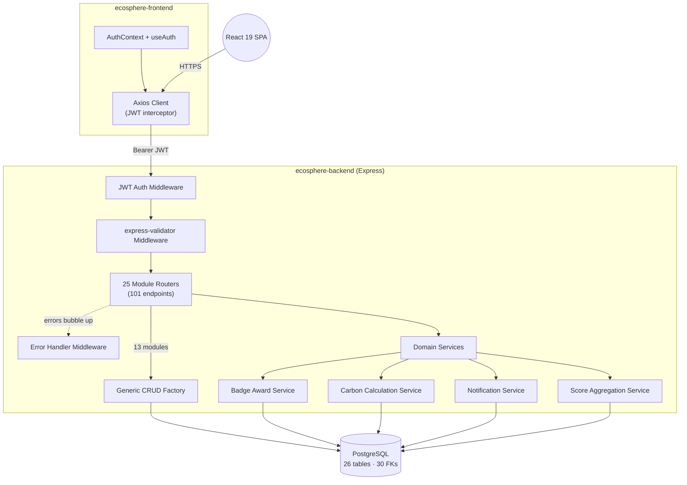

<div align="center">

  <h1>🌍 EcoSphere — ESG Management Platform</h1>

  <p>
    <strong>A full-stack enterprise platform that turns corporate ESG (Environmental, Social, Governance) tracking from a compliance chore into a measurable, auditable, and gamified system.</strong>
  </p>

  <p>
    <a href="#"></a>
    <a href="#"></a>
    <a href="#"></a>
    <a href="#"></a>
    <a href="#"></a>
    <a href="#"></a>
  </p>

  <p>
    Built in <strong>8 hours</strong> at <strong>Odoo Hackathon 2026</strong> (Virtual Round) — Team <strong>14-DHIVYA</strong>
  </p>

</div>

---

## Table of Contents
1. [The Problem](#the-problem)
2. [What EcoSphere Does](#what-ecosphere-does)
3. [By the Numbers](#by-the-numbers)
4. [System Architecture](#system-architecture)
5. [Database Design](#database-design)
6. [Backend Engineering](#backend-engineering)
7. [Frontend Engineering](#frontend-engineering)
8. [API Reference](#api-reference)
9. [Getting Started](#getting-started)
10. [Configuration Reference](#configuration-reference)
11. [Known Limitations](#known-limitations)
12. [Roadmap](#roadmap)
13. [Team](#team)

---

## The Problem

Most corporate ESG tracking today lives in spreadsheets: emissions are logged manually, CSR activity is self-reported with no audit trail, and there's no feedback loop that makes an employee's individual action feel connected to the company's actual environmental score. This produces two failure modes:

* **On the compliance side** — policies get acknowledged in name only, audits happen retroactively, and there's no structured record linking a compliance issue to the department or policy it originated from.
* **On the engagement side** — sustainability initiatives fail because there's no incentive loop. Employees don't see how a single action (biking to work, finishing a training module) rolls up into a department-level or company-level metric.

EcoSphere was built to close both gaps in a single system: transactional ESG data on one side, a gamification layer on the other, tied together by a shared department and employee data model.

---

## What EcoSphere Does

* **Carbon Transaction Ledger** — Departments log carbon-relevant activity (travel, energy use, waste), and the system computes CO₂-equivalent values against configurable emission factors rather than hardcoded conversions.
* **Gamified Employee Engagement** — Employees join challenges (e.g. "Bike to Work Week"), earn badges through a rule-evaluation engine, accumulate XP, and redeem points for rewards.
* **CSR & Volunteer Tracking** — Company-wide CSR activities and individual volunteer hours are logged and attributed to departments.
* **Policy Compliance Loop** — ESG policies are published, employee acknowledgments are tracked individually, and audits log compliance issues against specific policies or departments.
* **Automated Score Aggregation** — A dedicated scoring service recomputes Environmental, Social, and Governance sub-scores per department whenever underlying data changes, rather than computing scores on-demand at read time.
* **Notification System** — In-app notifications respect per-employee opt-out settings rather than firing unconditionally.

---

## By the Numbers

These are measured against the actual repository, not estimated.

| Metric | Value |
|---|---|
| REST API endpoints | **101** across 25 feature modules |
| Database tables | **26** |
| Foreign key relationships | **30** |
| Database indexes | **7** |
| Modules using the generic CRUD factory | **13 / 25** |
| Backend lines of code | **1,678** |
| Frontend lines of code | **1,525** |
| Commits during the coding window | **45** |
| Build window | **8 hours** (Odoo Hackathon 2026, Virtual Round) |

<sub>Numbers generated via static analysis of `routes.js`, `schema.sql`, and `wc -l` against the source tree — see [Developer Guide](#getting-started) to reproduce.</sub>

---

## System Architecture

### Component Topology



### Design Patterns Used

* **Controller Factory Pattern** — `crudFactory.js` dynamically generates `list`, `getById`, `create`, `update`, and `remove` handlers for master-data tables, eliminating repetitive boilerplate across 13 of 25 modules while leaving room for custom logic (e.g. `carbonTransactions`, `challengeParticipation`) where a generic handler isn't sufficient.
* **Middleware Chain** — Auth → Validation → Route Handler → centralized Error Handler, so no route implements its own auth check or error formatting.
* **Service Layer Separation** — Cross-cutting business logic (badge rule evaluation, emission math, score aggregation, notification dispatch) lives outside route handlers in `src/services/`, keeping routers thin.
* **React Context for Auth State** — `AuthContext` + `useAuth` hook centralizes session state instead of prop-drilling the current user through the component tree.

---

## Database Design

The schema models ESG data as two linked domains sharing a common `departments`/`employees` core:

**Compliance & Environmental domain:**
`departments`, `employees`, `categories`, `emission_factors`, `products`, `product_esg_profiles`, `environmental_goals`, `esg_policies`, `policy_acknowledgements`, `audits`, `compliance_issues`, `department_scores`, `diversity_metrics`, `carbon_transactions`

**Engagement & Gamification domain:**
`badges`, `employee_badges`, `rewards`, `reward_redemptions`, `csr_activities`, `employee_participations`, `challenges`, `challenge_participations`, `training_completions`, `notifications`, `notification_settings`, `esg_config`

The two domains are joined through `employees` and `departments` as shared foreign keys — every gamification event (a badge earned, a challenge completed) is traceable back to a department, which is what feeds `department_scores`. **30 foreign key constraints** enforce this referential integrity at the database level rather than relying on application-layer checks alone.

---

## Backend Engineering

### Auth
JWT-based, stateless. `auth.js` extracts the Bearer token from the `Authorization` header, verifies it against `JWT_SECRET`, and attaches the decoded payload to the request. Missing, malformed, or expired tokens short-circuit with a `401` before the request reaches any route logic — role-based guards are layered on top of this for restricted endpoints.

### Validation
Every mutating endpoint runs through `express-validator` via `validate.js`. Validation failures are collected into a structured array and returned as a single `400` — routes never hand-roll their own input checks.

### Error Handling
A single global error handler (`errorHandler.js`) is the only place in the codebase that shapes error responses. It distinguishes application-level `ApiError`s from raw PostgreSQL constraint violations (e.g. duplicate key on a unique constraint) and normalizes both into the same response contract:

```json
{
  "success": false,
  "message": "Human-readable error description",
  "details": ["optional field-level specifics"]
}
```

### Domain Services
| Service | Responsibility |
|---|---|
| `carbonCalculationService.js` | Computes CO₂-equivalent values from emission factors and logged quantities, writes the resulting `carbon_transactions` row |
| `badgeAwardService.js` | Evaluates active badge unlock rules against an employee's current XP/stats and auto-awards qualifying badges, triggering a notification |
| `scoreAggregationService.js` | Recomputes a department's Environmental / Social / Governance sub-scores and upserts into `department_scores` |
| `notificationService.js` | Creates in-app notifications while respecting each employee's per-category opt-out settings |

Keeping this logic out of route handlers means a badge can be awarded from more than one trigger point (a challenge completion, a training completion) without duplicating the unlock-rule logic.

---

## Frontend Engineering

* **React 19 + TypeScript + Vite** — fast dev server, typed API surface.
* **Centralized Axios client** (`api/client.ts`) — attaches the JWT from `localStorage` to every outgoing request via an interceptor, and on any `401` response, clears local session state and forces a redirect to login. This means individual components never handle auth failure themselves.
* **AuthContext + useAuth** — a single source of truth for `user` and `loading` state, hydrated from `localStorage` on load, so route guards and UI conditionals stay consistent across the app.
* **Recharts** for department score / emissions visualization, **jsPDF + html2canvas** for exporting reports client-side, **lucide-react** for iconography.

---

## API Reference

101 endpoints across 25 modules, all under `/api/v1`. Representative examples:

### Log a Carbon Transaction
`POST /api/v1/carbonTransactions`
```json
{
  "department_id": 4,
  "category_id": 2,
  "quantity": 320,
  "unit": "kWh"
}
```
**Response (201)**
```json
{
  "success": true,
  "data": {
    "id": 118,
    "co2_equivalent_kg": 147.2,
    "department_id": 4,
    "logged_at": "2026-07-12T09:14:00Z"
  }
}
```

### Get Department ESG Score
`GET /api/v1/departmentScores/:departmentId`
```json
{
  "success": true,
  "data": {
    "department_id": 4,
    "environmental_score": 78.4,
    "social_score": 65.1,
    "governance_score": 82.0,
    "last_calculated": "2026-07-12T09:15:03Z"
  }
}
```

### Full Endpoint Breakdown by Module

| Module | Endpoints | Module | Endpoints |
|---|---|---|---|
| audits | 5 | environmentalGoals | 5 |
| auth | 3 | esgPolicies | 5 |
| badges | 6 | notifications | 4 |
| carbonTransactions | 4 | policyAcknowledgements | 2 |
| categories | 5 | products | 5 |
| challengeParticipation | 4 | reports | 5 |
| challenges | 5 | rewardRedemptions | 2 |
| complianceIssues | 4 | rewards | 5 |
| config | 2 | trainingCompletions | 4 |
| csrActivities | 5 | departmentScores | 3 |
| departments | 5 | diversityMetrics | 4 |
| emissionFactors | 5 | employeeParticipation | 3 |
| employees | 1 | | |

---

## Getting Started

### Prerequisites
* Node.js 18+
* PostgreSQL 15+

### Backend
```bash
cd ecosphere-backend
npm install
cp .env.example .env
# fill in DB_HOST, DB_PORT, DB_USER, DB_PASSWORD, DB_NAME, JWT_SECRET

# apply schema and seed data
psql -U your_user -d your_db -f src/db/schema.sql
psql -U your_user -d your_db -f src/db/seed.sql

npm run dev
```

### Frontend
```bash
cd ecosphere-frontend
npm install
npm run dev
```

### Reproducing the numbers in this README
```bash
# endpoint count by module
find ecosphere-backend/src/modules -name "routes.js" | \
  xargs grep -E "router\.(get|post|put|delete|patch)" | wc -l

# table count
grep -ic "CREATE TABLE" ecosphere-backend/src/db/schema.sql

# lines of code
find ecosphere-backend/src -name "*.js" | xargs wc -l | tail -1
find ecosphere-frontend/src -name "*.tsx" -o -name "*.ts" | xargs wc -l | tail -1
```

---

## Configuration Reference

| Variable | Purpose |
|---|---|
| `PORT` | Port the Express server listens on |
| `DB_HOST` | PostgreSQL host |
| `DB_PORT` | PostgreSQL port |
| `DB_USER` | Database auth user |
| `DB_PASSWORD` | Database auth password |
| `DB_NAME` | Target database name |
| `JWT_SECRET` | Signing secret for JWT issuance/verification |

---

## Known Limitations

Being transparent about these rather than glossing over them:

* **No automated test suite yet.** Given the 8-hour build window, correctness was verified manually against the seed data rather than with `jest`/`supertest`. This is the top priority post-hackathon.
* **Seed data is minimal** (1 row per table) — enough to demonstrate the schema and relationships, not representative of production-scale volume.
* **Score aggregation runs synchronously on write**, not on a schedule or queue — acceptable at hackathon scale, but would need to move to a background job (or be debounced) under real transaction volume.
* **No rate limiting or request throttling** on the API yet — the auth and validation layers are hardened, but abuse protection wasn't in scope for the 8-hour window.

---

## Roadmap

- [ ] Automated test coverage for services and route handlers (Jest + Supertest)
- [ ] Rate limiting on public-facing endpoints
- [ ] Background job queue for score aggregation instead of synchronous recompute
- [ ] Role-based dashboard views (admin vs. employee vs. department lead)
- [ ] CSV/bulk import for carbon transactions to support real-world data volumes
- [ ] Public API docs (OpenAPI/Swagger) generated from the existing route definitions

---

## Team

Built by **Team 14-DHIVYA** at **Odoo Hackathon 2026** — Virtual Round, Problem Statement: *EcoSphere ESG Management Platform*.

* **DHIVYA** — Team Lead
* **Divyadharshini K**
* **Kavisurya B**

---

<div align="center">
<sub>Built in 8 hours. 101 endpoints, 26 tables, zero shortcuts on the schema.</sub>
</div>
