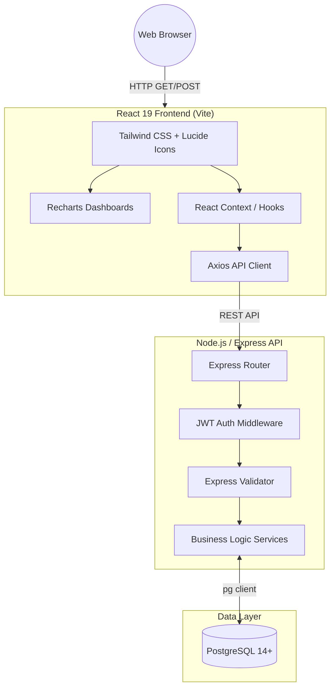

<div align="center">
  <!-- You can replace with an actual logo if you have one -->
  <h1>EcoSphere ESG Management Platform</h1>

  <p>
    <strong>A comprehensive, full-stack Environmental, Social, and Governance (ESG) platform designed to track corporate sustainability, ensure compliance, and gamify employee engagement.</strong>
  </p>

  <!-- Badges -->
  <p>
    <a href="https://react.dev"></a>
    <a href="https://nodejs.org"></a>
    <a href="https://expressjs.com"></a>
    <a href="https://www.postgresql.org/"></a>
    <a href="https://tailwindcss.com"></a>
  </p>
</div>

---

## Table of Contents
1. [System Overview](#system-overview)
2. [Core ESG Modules](#core-esg-modules)
3. [System Architecture](#system-architecture)
4. [Getting Started (Local Development)](#getting-started-local-development)
5. [Database Schema Highlights](#database-schema-highlights)
6. [Security & Compliance](#security--compliance)
7. [Developer Guide](#developer-guide)

---

## System Overview

EcoSphere bridges the gap between corporate sustainability reporting and daily employee engagement. Traditional ESG tools are often siloed reporting dashboards. EcoSphere actively involves employees through gamification while providing executives with rigorous compliance auditing and carbon accounting.

**Key capabilities include:**
* **Carbon Footprint Tracking**: Track Scope 1, 2, and 3 emissions through automated calculations using configurable emission factors.
* **Employee Gamification**: Employees earn XP and badges for participating in CSR activities and environmental challenges. Points can be redeemed for rewards.
* **Compliance & Auditing**: End-to-end tracking of ESG policies, acknowledgments, audits, and compliance issues with severity and SLAs.
* **Product ESG Profiles**: Analyze and maintain sustainability scores and carbon footprints for individual SKUs/products.

---

## Core ESG Modules

### 🌍 Environmental
- **Carbon Transactions**: Logs emissions from various sources (Purchases, Manufacturing, Fleet).
- **Emission Factors**: Reference data for calculating CO2 equivalent automatically.
- **Environmental Goals**: Department-level targets (e.g., "Reduce CO2 by 10%").

### 🤝 Social
- **Diversity Metrics**: Tracks gender and age demographics over reporting periods.
- **CSR Activities & Challenges**: Corporate Social Responsibility initiatives that employees can participate in.
- **Training Completions**: Tracking ESG training compliance.

### ⚖️ Governance
- **ESG Policies**: Centralized policy management with versioning.
- **Audits & Compliance Issues**: Scheduled audits that produce trackable, assigned compliance issues.
- **Department Scores**: Aggregated E, S, and G scores for comprehensive departmental performance tracking.

---

## System Architecture

### Component Topology



### Tech Stack Details
* **Frontend**: React 19, React Router v7, Tailwind CSS v4, Recharts, Vite, TypeScript.
* **Backend**: Node.js, Express, PostgreSQL (`pg`), JWT for authentication, bcryptjs for password hashing.

---

## Getting Started (Local Development)

### Prerequisites
* Node.js (v18+)
* PostgreSQL (v14+)
* Git

### 1. Database Setup
Ensure PostgreSQL is running, then create the database and run migrations:
```bash
# Create the database
createdb -U postgres ecosphere

# Navigate to backend
cd ecosphere-backend

# Install dependencies
npm install

# Setup environment variables
cp .env.example .env
# Edit .env with your DB credentials (DB_USER, DB_PASSWORD, DB_NAME, JWT_SECRET)

# Run schema migrations and seed data
npm run migrate
npm run seed
```

### 2. Start the Backend API
```bash
# In ecosphere-backend directory
npm run dev
# The API will start on http://localhost:4000
```

### 3. Start the Frontend App
```bash
# In a new terminal, navigate to frontend
cd ecosphere-frontend

# Install dependencies
npm install

# Start the Vite development server
npm run dev
# The app will be available at http://localhost:5173
```

---

## Database Schema Highlights

EcoSphere is built on a highly normalized relational schema designed for extensibility:

* **`departments` & `employees`**: Core organizational hierarchy and RBAC (Role-Based Access Control).
* **`carbon_transactions`**: The ledger for all emission-generating events, automatically converting quantities to CO2e using the `emission_factors` table.
* **`department_scores`**: A materialized-view-like table capturing E, S, and G scores per period.
* **`compliance_issues`**: Tracks audit findings with SLAs (Due Dates, Severity, Owners).

---

## Security & Compliance

* **Authentication**: Stateless JSON Web Tokens (JWT) used for all secure endpoints.
* **Password Hashing**: User passwords are cryptographically hashed using `bcryptjs`.
* **Security Headers**: The backend employs `helmet` to set secure HTTP headers (HSTS, CSP, X-Frame-Options).
* **Input Validation**: All incoming API requests are sanitized and validated using `express-validator` to prevent SQL Injection and XSS attacks.
* **RBAC (Role-Based Access Control)**: Enforcement of roles (`ADMIN`, `MANAGER`, `EMPLOYEE`, `AUDITOR`) at the middleware layer.

---

## Developer Guide

### Frontend Formatting & Linting
The frontend uses Oxlint for blazing-fast linting:
```bash
npm run lint
```

### Building for Production
**Frontend:**
```bash
npm run build
# Outputs static files to dist/
```

**Backend:**
The backend can be started in production using:
```bash
npm start
```

---
*EcoSphere ESG Management Platform*
